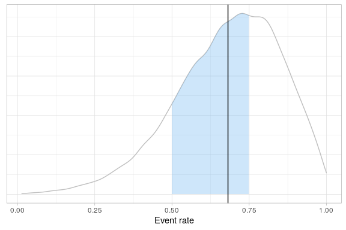

<!-- README.md is generated from README.Rmd. Please edit that file -->

# rbqmR

<!-- badges: start -->

[](https://CRAN.R-project.org/package=rbqmR)
<a href="https://www.repostatus.org/#wip"></a>
[](https://opensource.org/licenses/Apache-2.0)
<!-- badges: end -->

## Introduction

The purpose of the `rbqmR` package is to provide a repository of r-based
tools for the implementation of risk-based quality management.

Tools currently exist for

-   Dynamic Quality Tolerance Limits (QTLs) using Bayesian Hierarchical
    Models (ongoing)
-   Observed-Minus-Expected methodology (ongoing)

This package is a work-in-progress.

## Installation

You can install the development version of rbqmR from
[GitHub](https://github.com/) with:

``` r
# install.packages("devtools")
devtools::install_github("openpharma/rbqmR")
```

## Examples

### Dynamic QTLs

We use the example described on pages xx to xx Berry et al \[@BERRY\],
modifying the context so that rather than being a meta analysis of
several different trials, we consider the data to represent the
performance of different sites within a single trial. The exact metric
being measured is immaterial, though it remains a summary of a binomial
outcome.

``` r
data(berrySummary)

berrySummary %>% kable(digits=c(0,0,0,2))
```

<table>
<thead>
<tr>
<th style="text-align:right;">
Site
</th>
<th style="text-align:right;">
Subjects
</th>
<th style="text-align:right;">
Events
</th>
<th style="text-align:right;">
ObservedResponse
</th>
</tr>
</thead>
<tbody>
<tr>
<td style="text-align:right;">
1
</td>
<td style="text-align:right;">
20
</td>
<td style="text-align:right;">
20
</td>
<td style="text-align:right;">
1.00
</td>
</tr>
<tr>
<td style="text-align:right;">
2
</td>
<td style="text-align:right;">
10
</td>
<td style="text-align:right;">
4
</td>
<td style="text-align:right;">
0.40
</td>
</tr>
<tr>
<td style="text-align:right;">
3
</td>
<td style="text-align:right;">
16
</td>
<td style="text-align:right;">
11
</td>
<td style="text-align:right;">
0.69
</td>
</tr>
<tr>
<td style="text-align:right;">
4
</td>
<td style="text-align:right;">
19
</td>
<td style="text-align:right;">
10
</td>
<td style="text-align:right;">
0.53
</td>
</tr>
<tr>
<td style="text-align:right;">
5
</td>
<td style="text-align:right;">
14
</td>
<td style="text-align:right;">
5
</td>
<td style="text-align:right;">
0.36
</td>
</tr>
<tr>
<td style="text-align:right;">
6
</td>
<td style="text-align:right;">
46
</td>
<td style="text-align:right;">
36
</td>
<td style="text-align:right;">
0.78
</td>
</tr>
<tr>
<td style="text-align:right;">
7
</td>
<td style="text-align:right;">
10
</td>
<td style="text-align:right;">
9
</td>
<td style="text-align:right;">
0.90
</td>
</tr>
<tr>
<td style="text-align:right;">
8
</td>
<td style="text-align:right;">
9
</td>
<td style="text-align:right;">
7
</td>
<td style="text-align:right;">
0.78
</td>
</tr>
<tr>
<td style="text-align:right;">
9
</td>
<td style="text-align:right;">
6
</td>
<td style="text-align:right;">
4
</td>
<td style="text-align:right;">
0.67
</td>
</tr>
</tbody>
</table>

The central tenet of the QTL methodology implemented in `rbqmR` is not
that a current trial should behave in a similar fashion to a “similar”
historical or control trial, but rather that all sites within the
current trial should behave in a similar way. The justification for this
assumption is that the trial’s inclusion/exclusion criteria are designed
to minimise heterogeneity amongst the study population (save for that
induced by differences in treatment in comparative trials).

We fit the Bayesian Hierarchical Model described by Berry et al …

``` r
fitted <- berrySummary %>% 
            fitBayesBinomialModel(n=Subjects, r=Events)
#> Loading required namespace: rjags
```

… and use the quantiles of the posterior distribution of the probability
of an event to define the QTLs for this metric. This can be done in
isolation (when the trial acts as its own control) or with reference to
historical data obtained from similar previous studies.

#### Without historical data

For the sake of argument, suppose we set the lower and upper QTLs to be
the 5th and 95th centiles of the posterior respectively. Since we have
nine sites, it’s not unreasonable to expect one site to be outside this
range. So we define a breach of the QTL to have occurred when the
observed event rates at two or more sites fall outside this range.

The 5th and 95th centiles of the posterior are

``` r
quantiles <- fitted$tab %>% 
               summarise(
                 Q05=quantile(p, probs=0.05),
                 Q95=quantile(p, probs=0.95)
               )
quantiles
#> # A tibble: 1 × 2
#>     Q05   Q95
#>   <dbl> <dbl>
#> 1 0.369 0.935
```

So, in this specific case, our QTLs translate to observed event rates of
36.85% and 93.45% respectively.

Do any sites have observed event rates outside this range?

``` r
berrySummary %>% 
  applyQtl(
    var = ObservedResponse, 
    lower =quantiles %>% pull(Q05),
    upper = quantiles %>% pull(Q95)
  ) %>% 
  kable(
    digits=c(0, 0, 0, 3, 3, 3),
    caption="Sites breaching the QTL"
  )
#> Joining, by = c("Site", "Subjects", "Events", "ObservedResponse")
```

<table>
<caption>
Sites breaching the QTL
</caption>
<thead>
<tr>
<th style="text-align:right;">
Site
</th>
<th style="text-align:right;">
Subjects
</th>
<th style="text-align:right;">
Events
</th>
<th style="text-align:right;">
ObservedResponse
</th>
<th style="text-align:right;">
Lower
</th>
<th style="text-align:right;">
Upper
</th>
</tr>
</thead>
<tbody>
<tr>
<td style="text-align:right;">
1
</td>
<td style="text-align:right;">
20
</td>
<td style="text-align:right;">
20
</td>
<td style="text-align:right;">
1.000
</td>
<td style="text-align:right;">
0.369
</td>
<td style="text-align:right;">
0.935
</td>
</tr>
<tr>
<td style="text-align:right;">
5
</td>
<td style="text-align:right;">
14
</td>
<td style="text-align:right;">
5
</td>
<td style="text-align:right;">
0.357
</td>
<td style="text-align:right;">
0.369
</td>
<td style="text-align:right;">
0.935
</td>
</tr>
</tbody>
</table>

Yes. Two sites are outside this range. One above and one below. The QTL
has been breached. The process can be summarised graphically.

``` r
fitted$tab %>% 
  createQtlPlot(
    qtl=quantiles,
    siteData=berrySummary
  )
```


#### With historical data

Suppose previous experience tells us that the event probabiity in this
type of study should be between 0.50 and 0.75. We define the QTL such
that we require the posterior event probability for a new participant to
be in the range 0.5 to 0.75 inclusive to be at least 50%.

> When using a Bayesian Hierarchical Model, the probabilties associated
> with credible intervals are generally lower than those associated with
> similar frequentist models. This is because BHMs permit more sources
> of variation. Here, the BHM permits variation between the response
> rates at different sites, even when considering the overall event rate
> for the study. The corresponding frequentist analysis assumes that all
> sites share common event rate, thus assuming there is no inter-site
> variation.

``` r
fitted$tab %>% 
  summarise(PosteriorProb=mean(p >= 0.5 & p <= 0.75))
#> # A tibble: 1 × 1
#>   PosteriorProb
#>           <dbl>
#> 1         0.466
```

Again, the QTL is breached, and the process can be summarised
graphically.

``` r
fitted$tab %>%
  createQtlPlot(
    targetRange=c(0.5, 0.75),
    observedMetric=fitted$tab %>% summarise(Mean=mean(p)) %>% pull(Mean)
  )
#> [1] 0.6816473
```


### Observed - Expected Methodology

We generate some random data similar to that used by Gilbert
\[@GILBERT\], after setting a seed for reproducibility.

In order to illustrate what happens when a QTL is breached, we set the
probability that a participant reports an event to 0.13, even though the
QTL process will assume the event rate is 0.10…

``` r
set.seed(011327)

randomData <- tibble(
  Subject=1:400,
  Event=rbinom(400, 1, 0.13)
)
```

… and create an observed-expected table …

``` r
omeTable <- randomData %>% 
              createObservedMinusExpectedTable(
                timeVar = Subject,
                eventVar = Event,
                eventArray = 1,
                expectedRate = 0.1,
                maxTrialSize=400
              )
```

… and plot the corresponding graph.

``` r
omeTable %>%
  createObservedMinusExpectedPlot()
```



We can see that the trial breached a warning limit. When did this first
happen?

``` r
omeTable %>% 
  filter(Status !=  "OK") %>% 
  head(1) %>% 
  select(-contains("Action"), -SubjectIndex) %>% 
  kable(
    col.names=c("Subject", "Event", "Cumulative Events", "O - E", "Status", "Lower", "Upper"),
    caption="First breech of an action or warning limit"
  ) %>% 
  add_header_above(c(" "=5, "Warning Limits"=2))
```

<table>
<caption>
First breech of an action or warning limit
</caption>
<thead>
<tr>
<th style="empty-cells: hide;border-bottom:hidden;" colspan="5">
</th>
<th style="border-bottom:hidden;padding-bottom:0; padding-left:3px;padding-right:3px;text-align: center; " colspan="2">

<div style="border-bottom: 1px solid #ddd; padding-bottom: 5px; ">

Warning Limits

</div>

</th>
</tr>
<tr>
<th style="text-align:right;">
Subject
</th>
<th style="text-align:right;">
Event
</th>
<th style="text-align:right;">
Cumulative Events
</th>
<th style="text-align:right;">
O - E
</th>
<th style="text-align:left;">
Status
</th>
<th style="text-align:right;">
Lower
</th>
<th style="text-align:right;">
Upper
</th>
</tr>
</thead>
<tbody>
<tr>
<td style="text-align:right;">
62
</td>
<td style="text-align:right;">
1
</td>
<td style="text-align:right;">
13
</td>
<td style="text-align:right;">
6.8
</td>
<td style="text-align:left;">
WARN
</td>
<td style="text-align:right;">
-5.2
</td>
<td style="text-align:right;">
5.8
</td>
</tr>
</tbody>
</table>
