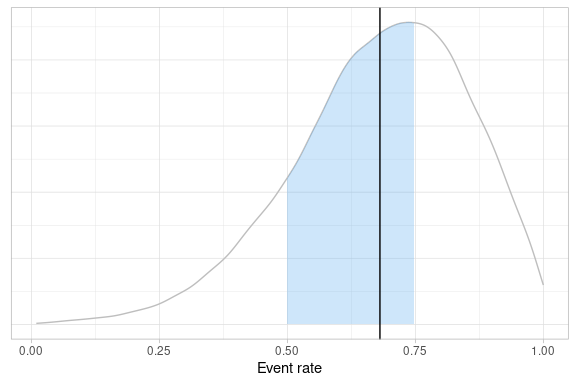
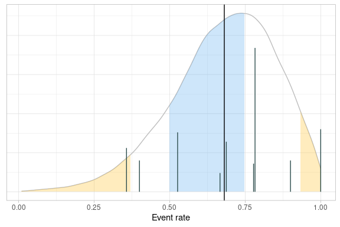
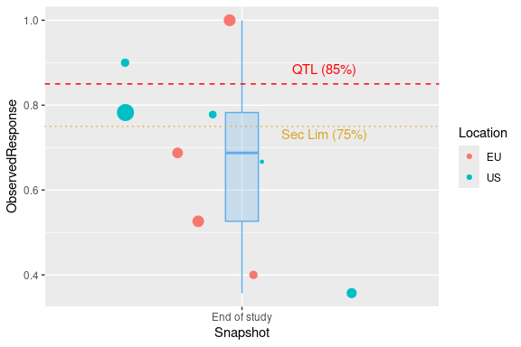
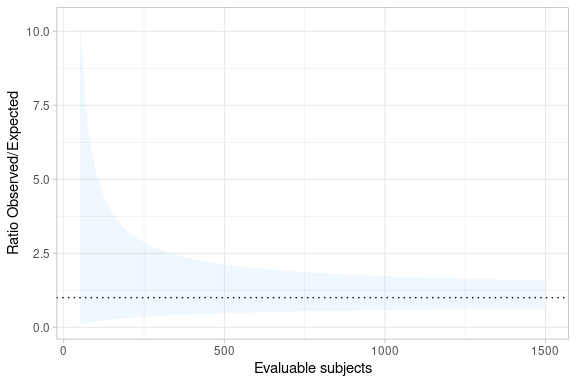

<!-- README.md is generated from README.Rmd. Please edit that file -->

# rbqmR

<!-- badges: start -->

[](https://CRAN.R-project.org/package=rbqmR)
<a href="https://www.repostatus.org/#wip"></a>
[](https://opensource.org/licenses/apache-2-0)
[](https://github.com/openpharma/rbqmR/actions)
[](https://github.com/openpharma/rbqmR/blob/_xml_coverage_reports/data/main/coverage.xml)<!-- badges: end -->

## Introduction

The purpose of the `rbqmR` package is to provide a repository of r-based
tools for the implementation of risk-based quality management.

Tools currently exist for

- Dynamic Quality Tolerance Limits (QTLs) using Bayesian Hierarchical
  Models (ongoing)
- Observed-Minus-Expected methodology
- Observed/Expected methodology (ongoing)

This package is a work-in-progress. It’s primary focus is dynamic QTLs.
Other methodologies are included for completeness.

## Installation

You can install the development version of rbqmR from
[GitHub](https://github.com/openpharma/rbqmR) with:

``` r
# install.packages("devtools")
devtools::install_github("openpharma/rbqmR")
```

## Dynamic QTLs

We use example 2.7 of Berry et al (Berry SM 2011), described on pages 52
to 63, modifying the context so that rather than being a meta analysis
of several different trials, we consider the data to represent the
performance of different sites within a single trial. The exact metric
being measured is immaterial, though it remains a summary of a binomial
outcome.

``` r
data(berrySummary)
berrySummary %>% kable(digits = c(0, 0, 0, 2))
```

<table>
<thead>
<tr>
<th style="text-align:right;">
Site
</th>
<th style="text-align:right;">
Subjects
</th>
<th style="text-align:right;">
Events
</th>
<th style="text-align:right;">
ObservedResponse
</th>
</tr>
</thead>
<tbody>
<tr>
<td style="text-align:right;">
1
</td>
<td style="text-align:right;">
20
</td>
<td style="text-align:right;">
20
</td>
<td style="text-align:right;">
1.00
</td>
</tr>
<tr>
<td style="text-align:right;">
2
</td>
<td style="text-align:right;">
10
</td>
<td style="text-align:right;">
4
</td>
<td style="text-align:right;">
0.40
</td>
</tr>
<tr>
<td style="text-align:right;">
3
</td>
<td style="text-align:right;">
16
</td>
<td style="text-align:right;">
11
</td>
<td style="text-align:right;">
0.69
</td>
</tr>
<tr>
<td style="text-align:right;">
4
</td>
<td style="text-align:right;">
19
</td>
<td style="text-align:right;">
10
</td>
<td style="text-align:right;">
0.53
</td>
</tr>
<tr>
<td style="text-align:right;">
5
</td>
<td style="text-align:right;">
14
</td>
<td style="text-align:right;">
5
</td>
<td style="text-align:right;">
0.36
</td>
</tr>
<tr>
<td style="text-align:right;">
6
</td>
<td style="text-align:right;">
46
</td>
<td style="text-align:right;">
36
</td>
<td style="text-align:right;">
0.78
</td>
</tr>
<tr>
<td style="text-align:right;">
7
</td>
<td style="text-align:right;">
10
</td>
<td style="text-align:right;">
9
</td>
<td style="text-align:right;">
0.90
</td>
</tr>
<tr>
<td style="text-align:right;">
8
</td>
<td style="text-align:right;">
9
</td>
<td style="text-align:right;">
7
</td>
<td style="text-align:right;">
0.78
</td>
</tr>
<tr>
<td style="text-align:right;">
9
</td>
<td style="text-align:right;">
6
</td>
<td style="text-align:right;">
4
</td>
<td style="text-align:right;">
0.67
</td>
</tr>
</tbody>
</table>

The central tenet of the QTL methodology implemented in `rbqmR` is not
that a current trial should behave in a similar fashion to a “similar”
historical or control trial, but rather that all sites within the
current trial should behave in a similar way. The justification for this
assumption is that the trial’s inclusion/exclusion criteria are designed
to minimise heterogeneity amongst the study population (save for that
induced by differences in treatment in comparative trials).

We fit the Bayesian Hierarchical Model described by Berry et al …

``` r
fitted <- berrySummary %>%
  fitBayesBinomialModel(n = Subjects, r = Events)
#> Loading required namespace: rjags
#> INFO [2024-06-14 06:39:27] Status of model fitting: OK
fitted
#> $tab
#> # A tibble: 20,000 × 4
#>        p     a     b     q
#>    <dbl> <dbl> <dbl> <int>
#>  1 0.925  4.01  1.45    95
#>  2 0.812  3.87  1.47    75
#>  3 0.848  3.75  2.81    83
#>  4 0.601  5.41  3.09    31
#>  5 0.457  6.93  2.32    11
#>  6 0.517  7.42  3.53    18
#>  7 0.666  8.52  3.45    43
#>  8 0.565  8.86  3.36    25
#>  9 0.837  8.51  2.20    81
#> 10 0.650  4.17  2.67    40
#> # ℹ 19,990 more rows
#> 
#> $results
#> 
#> JAGS model summary statistics from 20000 samples (chains = 2; adapt+burnin = 5000):
#>                                                                          
#>       Lower95  Median Upper95    Mean     SD Mode     MCerr MC%ofSD SSeff
#> p[10] 0.37138 0.69905   0.999 0.68206 0.1723   -- 0.0013275     0.8 16845
#> a      2.2354  5.8891  9.9845  5.9047 2.2792   --  0.055052     2.4  1714
#> b      0.6419  2.6299  5.1874  2.7811 1.2619   --  0.031599     2.5  1595
#>                       
#>           AC.10   psrf
#> p[10] 0.0032465 1.0001
#> a       0.19347 1.0001
#> b       0.21223 1.0001
#> 
#> Total time taken: 3.9 seconds
#> 
#> 
#> $status
#> [1] "OK"
```

… and use the quantiles of the posterior distribution of the probability
of an event to define the QTLs for this metric. This can be done in
isolation (when the trial acts as its own control) or with reference to
historical data obtained from similar previous studies.

### Examples of QTL evaluation rules

> When using a Bayesian Hierarchical Model, the probabilities associated
> with credible intervals are generally lower than those associated with
> similar frequentist models. This is because BHMs permit more sources
> of variation. Here, the BHM permits variation between the response
> rates at different sites, even when considering the overall event rate
> for the study. The corresponding frequentist analysis assumes that all
> sites share common event rate, thus assuming there is no inter-site
> variation.

#### Comparison to constant value(s)

The `evaluatePointEstimateQTL` allows the comparison of an arbitrary
scalar summary statistic (which defaults to the mean) derived from the
estimate of the posterior distribution, with an arbitrary number of
lower and upper limits.

For example, the code below defines a QTL based on the mean of the
posterior distribution of the probability of an event. Call this
probability $\hat{p}$. The warning limits are 0.5 and 0.8. The action
limits are 0.4 and 0.9.

``` r
berrySummary %>%
  evaluatePointEstimateQTL(
    posterior = fitted$tab,
    metric = p,
    observedMetric = ObservedResponse,
    lower = c("warn" = 0.5, "action" = 0.4),
    upper = c("warn" = 0.8, "action" = 0.9)
  )
#> $status
#> [1] "OK"
#> 
#> $qtl
#> [1] 0.6820645
#> 
#> $data
#> # A tibble: 9 × 5
#>    Site Subjects Events ObservedResponse Status
#>   <int>    <dbl>  <dbl>            <dbl> <chr> 
#> 1     1       20     20            1     action
#> 2     2       10      4            0.4   warn  
#> 3     3       16     11            0.688 OK    
#> 4     4       19     10            0.526 OK    
#> 5     5       14      5            0.357 warn  
#> 6     6       46     36            0.783 OK    
#> 7     7       10      9            0.9   warn  
#> 8     8        9      7            0.778 OK    
#> 9     9        6      4            0.667 OK
```

As with all `evaluateXXXXQTL` functions, the return value of
`evaluatePointEstimateQTL` is a list. The `status` element indicates
whether or not the QTL’s limits have been breached. The `qtl` element
gives the calculated value of the QTL metric and the `data` element
returns a copy of the `data.frame` containing the site level KRIs
augmented with a column indicating which, if any, of the various limits
were breached by that site.

Both the `lower` and `upper` parameters are optional (though at least
one must be given) and the number of limits, and their labels, are
arbitrary.

``` r
berrySummary %>%
  evaluatePointEstimateQTL(
    posterior = fitted$tab,
    metric = p,
    observedMetric = ObservedResponse,
    upper = c("mild" = 0.6, "moderate" = 0.8, "severe" = 0.9)
  )
```

If only one limit is defined, this can be provided as a scalar, in which
case it is labelled `action`.

The function on which the QTL is based is specified by the `stat`
parameter of `evaluatePointEstimateQTL` and can be a user-defined
function. For example, the following code fragments define QTLs based on
the median

``` r
berrySummary %>%
  evaluatePointEstimateQTL(
    posterior = fitted$tab,
    metric = p,
    stat = median,
    observedMetric = ObservedResponse,
    upper = c("warn" = 0.7, "action" = 0.9)
  )
#> $status
#> [1] "OK"
#> 
#> $qtl
#> [1] 0.6990512
#> 
#> $data
#> # A tibble: 9 × 5
#>    Site Subjects Events ObservedResponse Status
#>   <int>    <dbl>  <dbl>            <dbl> <chr> 
#> 1     1       20     20            1     action
#> 2     2       10      4            0.4   OK    
#> 3     3       16     11            0.688 OK    
#> 4     4       19     10            0.526 OK    
#> 5     5       14      5            0.357 OK    
#> 6     6       46     36            0.783 warn  
#> 7     7       10      9            0.9   warn  
#> 8     8        9      7            0.778 warn  
#> 9     9        6      4            0.667 OK
```

and 10th centile of the posterior distribution of $\hat{p}$.

``` r
berrySummary %>%
  evaluatePointEstimateQTL(
    posterior = fitted$tab,
    metric = p,
    stat = function(x) quantile(x, probs = 0.1),
    observedMetric = ObservedResponse,
    upper = c("warn" = 0.3, "action" = 0.8)
  )
#> $status
#> [1] "warn"
#> 
#> $qtl
#>       10% 
#> 0.4505905 
#> 
#> $data
#> # A tibble: 9 × 5
#>    Site Subjects Events ObservedResponse Status
#>   <int>    <dbl>  <dbl>            <dbl> <chr> 
#> 1     1       20     20            1     action
#> 2     2       10      4            0.4   warn  
#> 3     3       16     11            0.688 warn  
#> 4     4       19     10            0.526 warn  
#> 5     5       14      5            0.357 warn  
#> 6     6       46     36            0.783 warn  
#> 7     7       10      9            0.9   action
#> 8     8        9      7            0.778 warn  
#> 9     9        6      4            0.667 warn
```

#### Based on the probability that the derived metric is in a given range

Suppose previous experience tells us that the event probability in this
type of study should be between 0.50 and 0.75. We define the QTL such
that we require the posterior event probability for a new participant to
be in the range 0.5 to 0.75 inclusive to be at least 60%, with a warning
limit of 80%. Individual sites are flagged if their response rate is
either below 40% or above 85%.

``` r
qtlProbInRange <- berrySummary %>%
  evaluateProbabilityInRangeQTL(
    posterior = fitted$tab,
    metric = p,
    observedMetric = ObservedResponse,
    range = c(0.5, 0.75),
    probs = c("warn" = 0.8, "action" = 0.6),
    lower = 0.4,
    upper = 0.85
  )
qtlProbInRange
#> $status
#> [1] "action"
#> 
#> $qtl
#> [1] 0.4636
#> 
#> $data
#> # A tibble: 9 × 5
#>    Site Subjects Events ObservedResponse Status
#>   <int>    <dbl>  <dbl>            <dbl> <chr> 
#> 1     1       20     20            1     action
#> 2     2       10      4            0.4   OK    
#> 3     3       16     11            0.688 OK    
#> 4     4       19     10            0.526 OK    
#> 5     5       14      5            0.357 action
#> 6     6       46     36            0.783 OK    
#> 7     7       10      9            0.9   action
#> 8     8        9      7            0.778 OK    
#> 9     9        6      4            0.667 OK
```

Again, the QTL is breached, since the probability that the study-level
event rate is in the range \[0.5, 0.75\] is only 0.46.

#### Using an arbitrary criterion

`evaluatePointEstimateQTL`, `evaluateProbabilityInRangeQTL` (and
`evaluateSiteMetricQTL` discussed below) are wrappers around
`evaluateCustomQTL`, which can be used to evaluate an arbitrary,
user-defined QTL rule. `evaluateCustomQTL` takes the following
parameters:

- `data`: a tibble containing site-level observed metrics
- `posterior`: a tibble containing the posterior distribution of the
  metric, usually obtained from a fit Bayes model function.
- `f`: a function whose first two parameters are `data` and `posterior`,
  in that ordered and with those names
- `statusCol`: the column in `data` that defines the status of the site.
  Here, `Status`. Uses tidy evaluation.
- `...`: additional parameters passed to `f`.

Essentially, all that `evaluateCustomQTL` does is to perform some basic
checks on its parameter values and then return the value returned by
`data %>% f(posterior, ...)`. So, for example, a simplified version of
`evaluatePointEstimateQTL` that compares $\hat{p}$ to 0.6 might be

``` r
berrySummary %>%
  evaluateCustomQTL(
    posterior = fitted$tab,
    f = function(data, posterior) {
      rv <- list()
      rv$qtl <- posterior %>%
        summarise(qtl = mean(p)) %>%
        pull(qtl)
      rv$status <- ifelse(rv$qtl < 0.6, "OK", "Breach")
      rv$data <- data %>% mutate(Status = ifelse(ObservedResponse < 0.6, "OK", "Breach"))
      rv
    }
  )
#> $qtl
#> [1] 0.6820645
#> 
#> $status
#> [1] "Breach"
#> 
#> $data
#> # A tibble: 9 × 5
#>    Site Subjects Events ObservedResponse Status
#>   <int>    <dbl>  <dbl>            <dbl> <chr> 
#> 1     1       20     20            1     Breach
#> 2     2       10      4            0.4   OK    
#> 3     3       16     11            0.688 Breach
#> 4     4       19     10            0.526 OK    
#> 5     5       14      5            0.357 OK    
#> 6     6       46     36            0.783 Breach
#> 7     7       10      9            0.9   Breach
#> 8     8        9      7            0.778 Breach
#> 9     9        6      4            0.667 Breach
```

### Without historical data

Especially early in development of a new compound, project teams often
say they have no idea about what values of various metrics that could be
used to define QTLs might be. For conventionally defined QTLs this can
be a problem: an inappropriately chosen QTL might lead to a breach when,
in reality, there is no issue. Basing the QTL on the centiles of the
posterior distribution of the metric obtained from the QTL model just
fitted, and recalling that the purpose of inclusion/exclusion criteria
are to minimise heterogeneity, we can avoid this problem.

The `evaluateSiteMetricQTL` function calculates thresholds (for example
warning and action limits) by translating quantiles of the posterior
distribution of the metric to the real-life scale on which the metric is
measured. Again, we use the Berry data as an example.

``` r
rvSiteMetrics <- berrySummary %>%
  evaluateSiteMetricQTL(
    posterior = fitted$tab,
    metric = p,
    observedMetric = ObservedResponse,
    lower = c("action" = 0.05, "warn" = 0.2),
    upper = c("action" = 0.95, "warn" = 0.8)
  )
```

The `quantiles` element of the return value contains the mappings from
quantile of the posterior to observed values of the metric. For example,
the first row of `rvSiteMetrics$quantiles` shows that the lower action
limit is the 5th centile of the posterior, which corresponds to an event
probability of 0.372.

``` r
rvSiteMetrics$quantiles
#> # A tibble: 4 × 4
#>   Threshold Status Quantile     p
#>   <chr>     <chr>     <dbl> <dbl>
#> 1 Lower     action     0.05 0.372
#> 2 Lower     warn       0.2  0.538
#> 3 Upper     warn       0.8  0.837
#> 4 Upper     action     0.95 0.932
```

As before, the `data` element of the list contains a copy of the site
metric dataset, augmented by a column (named `Status` by default) that
allocates the observed site-level metrics (KRIs) to a band defined by
the thresholds in `lower` and `upper`.

``` r
rvSiteMetrics$data
#> # A tibble: 9 × 5
#>    Site Subjects Events ObservedResponse Status
#>   <int>    <dbl>  <dbl>            <dbl> <chr> 
#> 1     1       20     20            1     warn  
#> 2     2       10      4            0.4   warn  
#> 3     3       16     11            0.688 OK    
#> 4     4       19     10            0.526 warn  
#> 5     5       14      5            0.357 action
#> 6     6       46     36            0.783 OK    
#> 7     7       10      9            0.9   warn  
#> 8     8        9      7            0.778 OK    
#> 9     9        6      4            0.667 OK
```

> NB `rvSiteMetrics$data` contains incorrect values in the `Status`
> column. See [issue
> \#12](https://github.com/openpharma/rbqmR/issues/12). The `qtl`
> element of the return value contains counts of sites by threshold
> name.

``` r
rvSiteMetrics$qtl
#> # A tibble: 3 × 2
#>   Status     N
#>   <chr>  <int>
#> 1 OK         4
#> 2 action     1
#> 3 warn       4
```

Finally, the `status` of the returned QTL is `"OK"` by default.

``` r
rvSiteMetrics$status
#> [1] "OK"
```

However, `evaluateSiteMetricQTL` can be passed a function that can apply
an arbitrary rule to determine whether or not a breach has occurred. In
the example below, the function’s only argument is the `qtl` element of
`evaluateSiteMetricQTL`’s return value. For example, given that we have
nine sites in our fictitious example and we have calculated a 90%
posterior credible interval, it’s reasonable to expect one site to lie
outside this range. So we might say that a QTL breach has occurred if
two or more sites lie outside the credible interval:

``` r
(berrySummary %>%
  evaluateSiteMetricQTL(
    posterior = fitted$tab,
    metric = p,
    observedMetric = ObservedResponse,
    lower = c("action" = 0.5, "warn" = 0.6),
    upper = c("action" = 0.9, "warn" = 0.8),
    statusFunc = function(d) {
      ifelse(
        d %>%
          dplyr::filter(Status == "action") %>%
          dplyr::pull(N) >= 2, "action", "OK"
      )
    }
  ))$status
#> [1] "action"
```

## Representing the evaluation of a QTL graphically

Take, as an example, a QTL that requires a study level metric to lie
within a given range, as illustrated above.

``` r
fitted$tab %>%
  createQtlPlot(
    targetRange = list("lower" = 0.5, "upper" = 0.75),
    observedMetric = fitted$tab %>% summarise(Mean = mean(p)) %>% pull(Mean)
  )
```



The site-level KRIs can be added to the plot to help focus attention
where intervention is likely to have the largest effect.

``` r
fitted$tab %>%
  createQtlPlot(
    targetRange = list("lower" = 0.5, "upper" = 0.75),
    observedMetric = fitted$tab %>% summarise(Mean = mean(p)) %>% pull(Mean),
    actionLimits = list(
      list(
        "lower" = rvSiteMetrics$quantiles %>% filter(Threshold == "Upper", Status == "action") %>% pull(p),
        "upper" = NA,
        "alpha" = 0.3,
        "colour" = "goldenrod1"
      ),
      list(
        "lower" = NA,
        "upper" = rvSiteMetrics$quantiles %>% filter(Threshold == "Lower", Status == "action") %>% pull(p),
        "alpha" = 0.3,
        "colour" = "goldenrod1"
      )
    ),
    siteData = berrySummary,
    siteSize = Subjects,
    siteMetric = ObservedResponse
  )
```



## Presenting KRIs

The KRIs associated with a QTL can be presented graphically. `rmqmR`
includes the `createQtlBubblePlot` function, which presents the KRIs
(possibly from multiple evaluations of a QTL) in the form of a bubble
plot overlaid with a box-and-whisker plot. Site-level data may be
grouped in an arbitrary fashion, or not at all. Optionally, reference
lines that correspond to QTL thresholds may be added.

``` r
berrySummary %>%
  add_column(Snapshot = "End of study") %>%
  add_column(Location = c(rep("EU", 4), rep("US", 5))) %>%
  createQtlBubblePlot(
    x = Snapshot,
    y = ObservedResponse,
    size = Subjects,
    group = Location,
    boxWidth = 0.1,
    limits = list(
      list(
        label = "QTL (85%)",
        colour = "red",
        type = "dashed",
        y = 0.85,
        x = 1.25,
        vjust = -1
      ),
      list(
        label = "Sec Lim (75%)",
        colour = "goldenrod",
        type = "dotted",
        y = 0.75,
        x = 1.25,
        vjust = 1.25
      )
    )
  )
#> Warning: The following aesthetics were dropped during statistical transformation: size
#> ℹ This can happen when ggplot fails to infer the correct grouping structure in
#>   the data.
#> ℹ Did you forget to specify a `group` aesthetic or to convert a numerical
#>   variable into a factor?
```



## Observed - Expected Methodology

We generate some random data similar to that used by (Gilbert 2020),
after setting a seed for reproducibility.

In order to illustrate what happens when a QTL is breached, we set the
probability that a participant reports an event to 0.13, even though the
QTL process will assume the event rate is 0.10…

``` r
set.seed(011327)
randomData <- tibble(
  Subject = 1:400,
  Event = rbinom(400, 1, 0.13)
)
```

… and create an observed-expected table …

``` r
omeTable <- randomData %>%
  createObservedMinusExpectedTable(
    timeVar = Subject,
    eventVar = Event,
    eventArray = 1,
    expectedRate = 0.1,
    maxTrialSize = 400
  )
```

… and plot the corresponding graph.

``` r
omeTable %>%
  createObservedMinusExpectedPlot()
```


We can see that the trial breached a warning limit. When did this first
happen?

``` r
omeTable %>%
  filter(Status != "OK") %>%
  head(1) %>%
  select(-contains("Action"), -SubjectIndex) %>%
  kable(
    col.names = c("Subject", "Event", "Cumulative Events", "O - E", "Status", "Lower", "Upper"),
    caption = "First breach of an action or warning limit"
  ) %>%
  add_header_above(c(" " = 5, "Warning Limits" = 2))
```

<table>
<caption>
First breach of an action or warning limit
</caption>
<thead>
<tr>
<th style="empty-cells: hide;border-bottom:hidden;" colspan="5">
</th>
<th style="border-bottom:hidden;padding-bottom:0; padding-left:3px;padding-right:3px;text-align: center; " colspan="2">

<div style="border-bottom: 1px solid #ddd; padding-bottom: 5px; ">

Warning Limits

</div>

</th>
</tr>
<tr>
<th style="text-align:right;">
Subject
</th>
<th style="text-align:right;">
Event
</th>
<th style="text-align:right;">
Cumulative Events
</th>
<th style="text-align:right;">
O - E
</th>
<th style="text-align:left;">
Status
</th>
<th style="text-align:right;">
Lower
</th>
<th style="text-align:right;">
Upper
</th>
</tr>
</thead>
<tbody>
<tr>
<td style="text-align:right;">
62
</td>
<td style="text-align:right;">
1
</td>
<td style="text-align:right;">
13
</td>
<td style="text-align:right;">
6.8
</td>
<td style="text-align:left;">
WARN
</td>
<td style="text-align:right;">
-5.2
</td>
<td style="text-align:right;">
5.8
</td>
</tr>
</tbody>
</table>

## Observed / Expected methodology

Katz et al (Katz D 1978) calculate the confidence interval for the ratio
of two binomial random variables. We use this to determine QTLs for the
ratio of observed over expected proportions. The variability associated
with a ratio suggests that this methodology is likely to be useful only
for large studies with low expected event rates.

We require historical trial data to implement this methodology.

Suppose we have data on 10,000 historical patients who have reported a
given event at a rate of 1.4%. We are planning a 1500 patient trial and
have no reason to suppose the event rate in the trial will be any
different from what has been seen in the past.

``` r
createObservedOverExpectedTable(
  nHistorical = 10000,
  historicalRate = 0.014,
  expectedRate = 0.014,
  nObservedRange = seq(50, 1500, 25)
) %>%
  createObservedOverExpectedPlot()
```



As the trial is executed, the observed data can be added to the table
and the plot.

``` r
observedData <- tibble(
  NObserved = c(250, 500, 750, 1000),
  ObservedRate = 100 * c(2, 9, 15, 16) / NObserved
)
createObservedOverExpectedTable(
  nHistorical = 10000,
  historicalRate = 0.014,
  expectedRate = 0.014,
  nObservedRange = seq(50, 1500, 25),
  observedData = observedData,
  observedRate = ObservedRate
) %>% createObservedOverExpectedPlot(observedRate = ObservedRate)
```


> TODO Need to check interpretation of parameters

# Beyond TransCelerate

At the time of writing (late 2022) The TransCelerate Quality Tolerance
Limit Framework (Transcelerate 2020) lists metrics that are exclusively
binary in nature. There are many other potential metrics that are
non-binary and which may provide insight into the conduct of the trial.
For example,

- The number of episodes of rescue medication (as opposed to the
  percentage or number of trial participants on rescue medication)
- Time to withdrawal of consent (as opposed to the percentage or number
  of trial participants with withdrawal of informed consent)

As well as other metrics that can’t easily be dichotomised

- Drug plasma levels
- Number of (S)AEs reported per time unit of drug exposure
- Time to respond to data queries

The Bayesian QTL framework implemented in `rbqmR` can easily be extended
to include these other data types.

## Events per unit time

We use data on the numbers of Prussian cavalry officers kicked to death
by horses (Bortkiewicz 1898) to illustrate the method.

``` r
data("cavalryDeaths")
cavalryDeaths
#> # A tibble: 280 × 3
#>     Year Corps   Deaths
#>    <int> <fct>    <int>
#>  1  1875 Guards       0
#>  2  1875 Corps 1      0
#>  3  1875 Corps 2      0
#>  4  1875 Corps 3      0
#>  5  1875 Corps 4      0
#>  6  1875 Corps 5      0
#>  7  1875 Corps 6      0
#>  8  1875 Corps 7      1
#>  9  1875 Corps 8      1
#> 10  1875 Corps 9      0
#> # ℹ 270 more rows
```

Regard different cavalry Corps as “sites” and regard the number of years
for which data were collected as “exposure”.

``` r
cavalrySummary <- cavalryDeaths %>%
  group_by(Corps) %>%
  summarise(
    Deaths = sum(Deaths),
    TotalTime = n(),
    .groups = "drop"
  ) %>%
  mutate(DeathRate = Deaths / TotalTime)
cavalrySummary
#> # A tibble: 14 × 4
#>    Corps    Deaths TotalTime DeathRate
#>    <fct>     <int>     <int>     <dbl>
#>  1 Guards       16        20      0.8 
#>  2 Corps 1      16        20      0.8 
#>  3 Corps 2      12        20      0.6 
#>  4 Corps 3      12        20      0.6 
#>  5 Corps 4       8        20      0.4 
#>  6 Corps 5      11        20      0.55
#>  7 Corps 6      17        20      0.85
#>  8 Corps 7      12        20      0.6 
#>  9 Corps 8       7        20      0.35
#> 10 Corps 9      13        20      0.65
#> 11 Corps 10     15        20      0.75
#> 12 Corps 11     25        20      1.25
#> 13 Corps 14     24        20      1.2 
#> 14 Corps 15      8        20      0.4
```

Although not necessary here, because data for all Corps was recorded for
the same amount of time, the Poisson model used by `rbqmR` adjusts risk
by total exposure at the site.

``` r
getModelString("poisson")
```

    #> model {
    #>    for (i in 1:k) {
    #>      
    #>      events[i] ~ dpois(mu[i])
    #>      mu[i] <- lambda[i]*exposure[i]
    #>      
    #>      lambda[i] ~ dgamma(shape, 1/scale)
    #>    }
    #>    scale ~ dgamma(1, 1)
    #>    shape ~ dgamma(1, 1)
    #>  }

Fitting the model is straightforward.

``` r
poissonFit <- cavalrySummary %>%
  fitBayesPoissonModel(Deaths, TotalTime)
#> INFO [2024-06-14 06:39:38] Status of model fitting: OK
poissonFit$tab %>%
  createQtlPlot(
    metric = lambda,
    siteData = cavalrySummary,
    siteSize = TotalTime,
    siteMetric = DeathRate
  ) +
  labs(x = "Deaths per year")
```


# Environment

``` r
sessionInfo()
#> R version 4.3.1 (2023-06-16)
#> Platform: x86_64-pc-linux-gnu (64-bit)
#> Running under: Ubuntu 22.04.3 LTS
#> 
#> Matrix products: default
#> BLAS:   /usr/lib/x86_64-linux-gnu/openblas-pthread/libblas.so.3 
#> LAPACK: /usr/lib/x86_64-linux-gnu/openblas-pthread/libopenblasp-r0.3.20.so;  LAPACK version 3.10.0
#> 
#> locale:
#>  [1] LC_CTYPE=en_US.UTF-8       LC_NUMERIC=C              
#>  [3] LC_TIME=en_US.UTF-8        LC_COLLATE=en_US.UTF-8    
#>  [5] LC_MONETARY=en_US.UTF-8    LC_MESSAGES=en_US.UTF-8   
#>  [7] LC_PAPER=en_US.UTF-8       LC_NAME=C                 
#>  [9] LC_ADDRESS=C               LC_TELEPHONE=C            
#> [11] LC_MEASUREMENT=en_US.UTF-8 LC_IDENTIFICATION=C       
#> 
#> time zone: Etc/UTC
#> tzcode source: system (glibc)
#> 
#> attached base packages:
#> [1] stats     graphics  grDevices utils     datasets  methods   base     
#> 
#> other attached packages:
#>  [1] rbqmR_0.0.0.9002 testthat_3.2.0   lubridate_1.9.3  forcats_1.0.0   
#>  [5] stringr_1.5.0    dplyr_1.1.3      purrr_1.0.2      readr_2.1.4     
#>  [9] tidyr_1.3.0      tibble_3.2.1     ggplot2_3.4.3    tidyverse_2.0.0 
#> [13] kableExtra_1.3.4 magrittr_2.0.3  
#> 
#> loaded via a namespace (and not attached):
#>  [1] tidyselect_1.2.0     viridisLite_0.4.2    farver_2.1.1        
#>  [4] rjags_4-14           fastmap_1.1.1        promises_1.2.1      
#>  [7] digest_0.6.33        timechange_0.2.0     mime_0.12           
#> [10] lifecycle_1.0.3      ellipsis_0.3.2       processx_3.8.2      
#> [13] compiler_4.3.1       rlang_1.1.1          tools_4.3.1         
#> [16] utf8_1.2.3           yaml_2.3.7           knitr_1.44          
#> [19] lambda.r_1.2.4       labeling_0.4.3       prettyunits_1.2.0   
#> [22] htmlwidgets_1.6.2    pkgbuild_1.4.2       xml2_1.3.5          
#> [25] pkgload_1.3.3        miniUI_0.1.1.1       withr_2.5.1         
#> [28] desc_1.4.2           grid_4.3.1           fansi_1.0.5         
#> [31] urlchecker_1.0.1     profvis_0.3.8        toOrdinal_1.3-0.0   
#> [34] xtable_1.8-4         colorspace_2.1-0     scales_1.2.1        
#> [37] cli_3.6.1            rmarkdown_2.25       crayon_1.5.2        
#> [40] generics_0.1.3       remotes_2.4.2.1      rstudioapi_0.15.0   
#> [43] httr_1.4.7           tzdb_0.4.0           sessioninfo_1.2.2   
#> [46] cachem_1.0.8         rvest_1.0.3          parallel_4.3.1      
#> [49] formatR_1.14         vctrs_0.6.3          devtools_2.4.5      
#> [52] webshot_0.5.5        callr_3.7.3          hms_1.1.3           
#> [55] systemfonts_1.0.5    glue_1.6.2           ps_1.7.5            
#> [58] stringi_1.7.12       gtable_0.3.4         futile.logger_1.4.3 
#> [61] later_1.3.1          munsell_0.5.0        pillar_1.9.0        
#> [64] brio_1.1.3           htmltools_0.5.6.1    R6_2.5.1            
#> [67] rprojroot_2.0.3      evaluate_0.22        shiny_1.7.5         
#> [70] lattice_0.21-9       highr_0.10           futile.options_1.0.1
#> [73] memoise_2.0.1        httpuv_1.6.11        Rcpp_1.0.11         
#> [76] svglite_2.1.1        coda_0.19-4          xfun_0.40           
#> [79] fs_1.6.3             usethis_2.2.2        runjags_2.2.2-1.1   
#> [82] pkgconfig_2.0.3
```

# References

<div id="refs" class="references csl-bib-body hanging-indent">

<div id="ref-BERRY" class="csl-entry">

Berry SM, Lee JJ, Carlin BP. 2011. *Bayesian Adaptive Methods for
Clinical Trials*. CRC Press.

</div>

<div id="ref-Bortkiewicz1898" class="csl-entry">

Bortkiewicz, Ladislaus von. 1898. “Das Gesetz Der Kleinen Zahlen.”

</div>

<div id="ref-GILBERT" class="csl-entry">

Gilbert, SA. 2020. “Implementing Quality Tolerance Limits at a Large
Pharmaceutical Company.” *PharmaSUG*.

</div>

<div id="ref-KATZ" class="csl-entry">

Katz D, Azen SP, Baptista J. 1978. “Obtaining Confidence Intervals for
the Risk Ratio in Cohort Studies.” *Biometrics* 34 (3): 469–74.
https://doi.org/<https://doi.org/10.2307/2530610>.

</div>

<div id="ref-Transcelerate2020" class="csl-entry">

Transcelerate. 2020. “Quality Tolerance Limits Framework.” Research
report. Transcelerate Biopharma Inc. 2020.
<https://www.transceleratebiopharmainc.com/wp-content/uploads/2020/10/TransCelerate_InterpretationsOfClinical-GuidancesAndRegulations_Quality-Tolerance-Limits-Framework_October-2020.pdf>.

</div>

</div>
