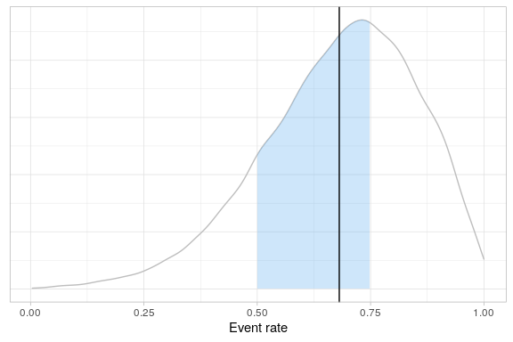

<!-- README.md is generated from README.Rmd. Please edit that file -->

# rbqmR

<!-- badges: start -->

[](https://CRAN.R-project.org/package=rbqmR)
<a href="https://www.repostatus.org/#wip"></a>
[](https://opensource.org/licenses/Apache-2.0)
[](https://github.com/openpharma/rbqmR/actions)
<!-- badges: end -->

## Introduction

The purpose of the `rbqmR` package is to provide a repository of r-based
tools for the implementation of risk-based quality management.

Tools currently exist for

-   Dynamic Quality Tolerance Limits (QTLs) using Bayesian Hierarchical
    Models (ongoing)
-   Observed-Minus-Expected methodology (ongoing)
-   Observed/Expected methodology (ongoing)

This package is a work-in-progress. It’s primary focus is dynamic QTLs.
Other methodologies are included for completeness.

## Installation

You can install the development version of rbqmR from
[GitHub](https://github.com/) with:

``` r
# install.packages("devtools")
devtools::install_github("openpharma/rbqmR")
```

## Examples

### Dynamic QTLs

We use example 2.7 of Berry et al (Berry SM 2011), described on pages 52
to 63, modifying the context so that rather than being a meta analysis
of several different trials, we consider the data to represent the
performance of different sites within a single trial. The exact metric
being measured is immaterial, though it remains a summary of a binomial
outcome.

``` r
data(berrySummary)

berrySummary %>% kable(digits=c(0,0,0,2))
```

<table>
<thead>
<tr>
<th style="text-align:right;">
Site
</th>
<th style="text-align:right;">
Subjects
</th>
<th style="text-align:right;">
Events
</th>
<th style="text-align:right;">
ObservedResponse
</th>
</tr>
</thead>
<tbody>
<tr>
<td style="text-align:right;">
1
</td>
<td style="text-align:right;">
20
</td>
<td style="text-align:right;">
20
</td>
<td style="text-align:right;">
1.00
</td>
</tr>
<tr>
<td style="text-align:right;">
2
</td>
<td style="text-align:right;">
10
</td>
<td style="text-align:right;">
4
</td>
<td style="text-align:right;">
0.40
</td>
</tr>
<tr>
<td style="text-align:right;">
3
</td>
<td style="text-align:right;">
16
</td>
<td style="text-align:right;">
11
</td>
<td style="text-align:right;">
0.69
</td>
</tr>
<tr>
<td style="text-align:right;">
4
</td>
<td style="text-align:right;">
19
</td>
<td style="text-align:right;">
10
</td>
<td style="text-align:right;">
0.53
</td>
</tr>
<tr>
<td style="text-align:right;">
5
</td>
<td style="text-align:right;">
14
</td>
<td style="text-align:right;">
5
</td>
<td style="text-align:right;">
0.36
</td>
</tr>
<tr>
<td style="text-align:right;">
6
</td>
<td style="text-align:right;">
46
</td>
<td style="text-align:right;">
36
</td>
<td style="text-align:right;">
0.78
</td>
</tr>
<tr>
<td style="text-align:right;">
7
</td>
<td style="text-align:right;">
10
</td>
<td style="text-align:right;">
9
</td>
<td style="text-align:right;">
0.90
</td>
</tr>
<tr>
<td style="text-align:right;">
8
</td>
<td style="text-align:right;">
9
</td>
<td style="text-align:right;">
7
</td>
<td style="text-align:right;">
0.78
</td>
</tr>
<tr>
<td style="text-align:right;">
9
</td>
<td style="text-align:right;">
6
</td>
<td style="text-align:right;">
4
</td>
<td style="text-align:right;">
0.67
</td>
</tr>
</tbody>
</table>

The central tenet of the QTL methodology implemented in `rbqmR` is not
that a current trial should behave in a similar fashion to a “similar”
historical or control trial, but rather that all sites within the
current trial should behave in a similar way. The justification for this
assumption is that the trial’s inclusion/exclusion criteria are designed
to minimise heterogeneity amongst the study population (save for that
induced by differences in treatment in comparative trials).

We fit the Bayesian Hierarchical Model described by Berry et al …

``` r
fitted <- berrySummary %>% 
            fitBayesBinomialModel(n=Subjects, r=Events)
#> Loading required namespace: rjags
```

… and use the quantiles of the posterior distribution of the probability
of an event to define the QTLs for this metric. This can be done in
isolation (when the trial acts as its own control) or with reference to
historical data obtained from similar previous studies.

#### Without historical data

For the sake of argument, suppose we set the lower and upper QTLs to be
the 5th and 95th centiles of the posterior respectively. Since we have
nine sites, it’s not unreasonable to expect one site to be outside this
range. So we define a breach of the QTL to have occurred when the
observed event rates at two or more sites fall outside this range.

The 5th and 95th centiles of the posterior are

``` r
quantiles <- fitted$tab %>% 
               summarise(
                 Q05=quantile(p, probs=0.05, names=FALSE),
                 Q95=quantile(p, probs=0.95, names=FALSE)
               )
quantiles
#> # A tibble: 1 × 2
#>     Q05   Q95
#>   <dbl> <dbl>
#> 1 0.371 0.932
```

So, in this specific case, our QTLs translate to observed event rates of
37.07% and 93.22% respectively.

Do any sites have observed event rates outside this range?

``` r
berrySummary %>% 
  applyQtl(
    var = ObservedResponse, 
    lower =quantiles %>% pull(Q05),
    upper = quantiles %>% pull(Q95)
  ) %>% 
  kable(
    digits=c(0, 0, 0, 3, 3, 3),
    caption="Sites breaching the QTL"
  )
#> Joining, by = c("Site", "Subjects", "Events", "ObservedResponse")
```

<table>
<caption>
Sites breaching the QTL
</caption>
<thead>
<tr>
<th style="text-align:right;">
Site
</th>
<th style="text-align:right;">
Subjects
</th>
<th style="text-align:right;">
Events
</th>
<th style="text-align:right;">
ObservedResponse
</th>
<th style="text-align:right;">
Lower
</th>
<th style="text-align:right;">
Upper
</th>
</tr>
</thead>
<tbody>
<tr>
<td style="text-align:right;">
1
</td>
<td style="text-align:right;">
20
</td>
<td style="text-align:right;">
20
</td>
<td style="text-align:right;">
1.000
</td>
<td style="text-align:right;">
0.371
</td>
<td style="text-align:right;">
0.932
</td>
</tr>
<tr>
<td style="text-align:right;">
5
</td>
<td style="text-align:right;">
14
</td>
<td style="text-align:right;">
5
</td>
<td style="text-align:right;">
0.357
</td>
<td style="text-align:right;">
0.371
</td>
<td style="text-align:right;">
0.932
</td>
</tr>
</tbody>
</table>

Yes. Two sites are outside this range. One above and one below. The QTL
has been breached. The process can be summarised graphically.

``` r
fitted$tab %>% 
  createQtlPlot(
    actionLimits=list(
                   list("lower"=quantiles$Q95, "upper"=NA, "alpha"=0.3, "colour"="goldenrod1"),
                   list("lower"=NA, "upper"=quantiles$Q05, "alpha"=0.3, "colour"="goldenrod1")
                 ),
    siteData=berrySummary,
    siteSize=Subjects,
    siteMetric=ObservedResponse
  )
```



#### With historical data

Suppose previous experience tells us that the event probability in this
type of study should be between 0.50 and 0.75. We define the QTL such
that we require the posterior event probability for a new participant to
be in the range 0.5 to 0.75 inclusive to be at least 50%.

> When using a Bayesian Hierarchical Model, the probabilties associated
> with credible intervals are generally lower than those associated with
> similar frequentist models. This is because BHMs permit more sources
> of variation. Here, the BHM permits variation between the response
> rates at different sites, even when considering the overall event rate
> for the study. The corresponding frequentist analysis assumes that all
> sites share common event rate, thus assuming there is no inter-site
> variation.

``` r
fitted$tab %>% 
  summarise(PosteriorProb=mean(p >= 0.5 & p <= 0.75))
#> # A tibble: 1 × 1
#>   PosteriorProb
#>           <dbl>
#> 1         0.470
```

Again, the QTL is breached, and the process can be summarised
graphically.

``` r
fitted$tab %>%
  createQtlPlot(
    targetRange=list("lower"=0.5, "upper"=0.75),
    observedMetric=fitted$tab %>% summarise(Mean=mean(p)) %>% pull(Mean)
  )
```


The site-level KRIs can be added to the plot to help focus attention
where intervention is likely to have the largest effect.

``` r
fitted$tab %>%
  createQtlPlot(
    targetRange=list("lower"=0.5, "upper"=0.75),
    observedMetric=fitted$tab %>% summarise(Mean=mean(p)) %>% pull(Mean),
    siteData=berrySummary,
    siteSize=Subjects,
    siteMetric=ObservedResponse,
    actionLimits=list(
                   list("lower"=quantiles$Q95, "upper"=NA, "alpha"=0.3, "colour"="goldenrod1"),
                   list("lower"=NA, "upper"=quantiles$Q05, "alpha"=0.3, "colour"="goldenrod1")
                 )
  )
```


### Observed - Expected Methodology

We generate some random data similar to that used by Gilbert (Gilbert
2020), after setting a seed for reproducibility.

In order to illustrate what happens when a QTL is breached, we set the
probability that a participant reports an event to 0.13, even though the
QTL process will assume the event rate is 0.10…

``` r
set.seed(011327)

randomData <- tibble(
  Subject=1:400,
  Event=rbinom(400, 1, 0.13)
)
```

… and create an observed-expected table …

``` r
omeTable <- randomData %>% 
              createObservedMinusExpectedTable(
                timeVar = Subject,
                eventVar = Event,
                eventArray = 1,
                expectedRate = 0.1,
                maxTrialSize=400
              )
```

… and plot the corresponding graph.

``` r
omeTable %>%
  createObservedMinusExpectedPlot()
```


We can see that the trial breached a warning limit. When did this first
happen?

``` r
omeTable %>% 
  filter(Status !=  "OK") %>% 
  head(1) %>% 
  select(-contains("Action"), -SubjectIndex) %>% 
  kable(
    col.names=c("Subject", "Event", "Cumulative Events", "O - E", "Status", "Lower", "Upper"),
    caption="First breech of an action or warning limit"
  ) %>% 
  add_header_above(c(" "=5, "Warning Limits"=2))
```

<table>
<caption>
First breech of an action or warning limit
</caption>
<thead>
<tr>
<th style="empty-cells: hide;border-bottom:hidden;" colspan="5">
</th>
<th style="border-bottom:hidden;padding-bottom:0; padding-left:3px;padding-right:3px;text-align: center; " colspan="2">

<div style="border-bottom: 1px solid #ddd; padding-bottom: 5px; ">

Warning Limits

</div>

</th>
</tr>
<tr>
<th style="text-align:right;">
Subject
</th>
<th style="text-align:right;">
Event
</th>
<th style="text-align:right;">
Cumulative Events
</th>
<th style="text-align:right;">
O - E
</th>
<th style="text-align:left;">
Status
</th>
<th style="text-align:right;">
Lower
</th>
<th style="text-align:right;">
Upper
</th>
</tr>
</thead>
<tbody>
<tr>
<td style="text-align:right;">
62
</td>
<td style="text-align:right;">
1
</td>
<td style="text-align:right;">
13
</td>
<td style="text-align:right;">
6.8
</td>
<td style="text-align:left;">
WARN
</td>
<td style="text-align:right;">
-5.2
</td>
<td style="text-align:right;">
5.8
</td>
</tr>
</tbody>
</table>

### Observed / Expected methodology

Katz et al (Katz D 1978) calculate the confidence interval for the ratio
of two binomial random variables. We use this to determine QTLs for the
ratio of observed over expected proportions. The variability associated
with a ratio suggests that this methodology is likely to be useful only
for large studies with low expected event rates.

We require historical trial data to implement this methodology.

Suppose we have data on 10,000 historical patients who have reported a
given event at a rate of 1.4%. We are planning a 1500 patient trial and
have no reason to suppose the event rate in the trial will be any
different from what has been seen in the past.

``` r
createObservedOverExpectedTable(
  nHistorical=10000,
  historicalRate=0.014,
  expectedRate=0.014,
  nObservedRange=seq(50, 1500, 25)
) %>% 
createObservedOverExpectedPlot()
```


As the trial is executed, the observed data can be added to the table
and the plot.

``` r
observedData <- tibble(
                  NObserved=c(250, 500, 750, 1000), 
                  ObservedRate=100*c(2, 9, 15, 16)/NObserved
                )

table <- createObservedOverExpectedTable(
           nHistorical=10000,
           historicalRate=0.014,
           expectedRate=0.014,
           nObservedRange=seq(50, 1500, 25),
           observedData=observedData
         )

table %>% createObservedOverExpectedPlot(observedRate=ObservedRate)
```


## Beyond Transcelerate

At the time of writing (late 2022) The Transcelerate Quality Tolerance
Limit Framework (Inc 2020) lists metrics that are exclusively binary in
nature. There are many other potential metrics that are non-binary and
which may provide insight into the conduct of the trial. For example,

-   The number of episodes of rescue medication (as opposed to the
    percentage or number of trial participants on rescue medication)
-   Time to withdrawal of consent (as percentage or number of trial
    participants with withdrawal of informed consent)

As well as other metrics that can’t esily be dichotomised

-   Drug plasma levels
-   Number of (S)AEs reported per time unit of drug exposure

The Bayesian QTL framework implemented in `rbqmR` can easily be extended
to include these other data types.

### Events per unit time

Bortkiewicz’s data on the numbers of Prussian cavalry officers kicked to
death by horses (Bortkiewicz 1898) can be used to illustrate the method.

``` r
data("cavalryDeaths")

cavalryDeaths
#> # A tibble: 280 × 3
#>     Year Corps   Deaths
#>    <int> <fct>    <int>
#>  1  1875 Guards       0
#>  2  1875 Corps 1      0
#>  3  1875 Corps 2      0
#>  4  1875 Corps 3      0
#>  5  1875 Corps 4      0
#>  6  1875 Corps 5      0
#>  7  1875 Corps 6      0
#>  8  1875 Corps 7      1
#>  9  1875 Corps 8      1
#> 10  1875 Corps 9      0
#> # … with 270 more rows
```

Regard different cavalry Corps as “sites” and regard the number of years
for which data were collected as “exposure”.

``` r
cavalrySummary <- cavalryDeaths %>% 
                group_by(Corps) %>% 
                summarise(
                  Deaths=sum(Deaths), 
                  TotalTime=n(), 
                  .groups="drop"
                ) %>% 
                mutate(DeathRate=Deaths/TotalTime)
                
cavalrySummary
#> # A tibble: 14 × 4
#>    Corps    Deaths TotalTime DeathRate
#>    <fct>     <int>     <int>     <dbl>
#>  1 Guards       16        20      0.8 
#>  2 Corps 1      16        20      0.8 
#>  3 Corps 2      12        20      0.6 
#>  4 Corps 3      12        20      0.6 
#>  5 Corps 4       8        20      0.4 
#>  6 Corps 5      11        20      0.55
#>  7 Corps 6      17        20      0.85
#>  8 Corps 7      12        20      0.6 
#>  9 Corps 8       7        20      0.35
#> 10 Corps 9      13        20      0.65
#> 11 Corps 10     15        20      0.75
#> 12 Corps 11     25        20      1.25
#> 13 Corps 14     24        20      1.2 
#> 14 Corps 15      8        20      0.4
```

Although not necessary here, because data for all Corps was recorded for
the same amount of time, the Poisson model used by `rbqmR` adjusts risk
by total exposure at the site.

``` r
getModelString("poisson")
#> [1] "model {\n   for (i in 1:k) {\n     \n     events[i] ~ dpois(mu[i])\n     mu[i] <- lambda[i]*exposure[i]\n     \n     lambda[i] ~ dgamma(shape, 1/scale)\n   }\n   scale ~ dgamma(1, 1)\n   shape ~ dgamma(1, 1)\n }"
```

Fitting the model is straightforward.

``` r
poissonFit <- cavalrySummary%>% 
                fitBayesPoissonModel(Deaths, TotalTime)
poissonFit$tab %>% 
  createQtlPlot(
    metric=lambda,
    siteData=cavalrySummary,
    siteSize=TotalTime,
    siteMetric=DeathRate    
  ) +
  labs(x="Deaths per year")
```


## References

<div id="refs" class="references csl-bib-body hanging-indent">

<div id="ref-BERRY" class="csl-entry">

Berry SM, Lee JJ, Carlin BP. 2011. *Bayesian Adaptive Methods for
Clinical Trials*. CRC Press.

</div>

<div id="ref-Bortkiewicz1898" class="csl-entry">

Bortkiewicz, Ladislaus von. 1898. “Das Gesetz Der Kleinen Zahlen.”

</div>

<div id="ref-GILBERT" class="csl-entry">

Gilbert, SA. 2020. “Implementing Quality Tolerance Limits at a Large
Pharmaceutical Company.” *PharmaSUG*.

</div>

<div id="ref-Transcelerate2020" class="csl-entry">

Inc, Transcelerate Biopharma. 2020. “Quality Tolerance Limits
Framework.” Research report. Transcelerate Biopharma Inc. 2020.
<https://www.transceleratebiopharmainc.com/wp-content/uploads/2020/10/TransCelerate_InterpretationsOfClinical-GuidancesAndRegulations_Quality-Tolerance-Limits-Framework_October-2020.pdf>.

</div>

<div id="ref-KATZ" class="csl-entry">

Katz D, Azen SP, Baptista J. 1978. “Obtaining Confidence Intervals for
the Risk Ratio in Cohort Studies.” *Biometrics* 34 (3): 469–74.
https://doi.org/<https://doi.org/10.2307/2530610>.

</div>

</div>
